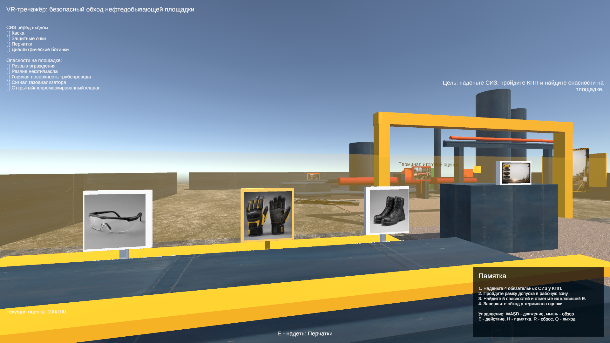
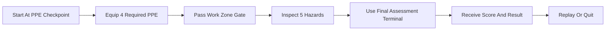

# Unity VR Oil Safety Trainer Demo

Desktop-first Unity safety trainer demo for oil production site inspections, designed as a one-scene MVP with a VR-ready architecture.



## Status

- Engine: Unity `6000.4.11f1`
- Platform: Windows desktop fallback, keyboard and mouse
- UI language: Russian
- Latest local verification: Edit Mode tests `41/41`, Windows build success, manual gameplay smoke passed
- Scope: portfolio-ready MVP, not a finished industrial training product

## Overview

This project simulates a short industrial safety walkthrough:

- select required PPE before entering the work zone,
- inspect five site hazards,
- complete a final assessment with scoring and replay support.

The current version targets keyboard and mouse interaction so the training loop can be validated quickly on a standard Windows machine. The scene structure and core gameplay scripts are organized to make a later OpenXR/XR rig swap straightforward.

## Highlights

- Desktop fallback controls with a `PlayerRig` abstraction for future XR support
- TextMeshPro Russian UI with checklist, guide, prompts, score, and final result screen
- ScriptableObject scenario config for PPE, hazards, penalties, recommendations, and scoring
- Secondary maintenance scenario config and generated scene to demonstrate scenario reuse
- Generated one-scene training yard with curated PPE and hazard reference art
- Editor-only scene builder split into focused environment, scenario, material, primitive, UI, layout, theme, and visual-catalog helpers
- Edit Mode regression tests covering scene layout, gameplay flow, reset behavior, hover state, Russian text, and HUD text fit
- Linear color space enabled for cleaner lighting and material response

## Training Flow



## Controls

- `WASD` - movement
- `Mouse` - look
- `E` - interact
- `H` - show or hide the guide
- `R` - reset scenario
- `Q` - quit demo
- `Esc` - pause cursor lock

## Project Structure

```text
Assets/
  Art/         curated PPE, poster, terminal, and hazard reference images
  Editor/      scene and project generator
  Materials/   generated Unity materials
  Scenarios/   ScriptableObject scenario configs
  Scenes/      generated demo and maintenance scenes
  Scripts/     gameplay, UI, player, and scenario logic
  Tests/       Edit Mode regression tests
  Textures/    local texture set used by the environment
docs/
  screenshots/ curated portfolio screenshots
Packages/
ProjectSettings/
```

## Architecture

Runtime gameplay is kept separate from editor scene generation:

- `SafetyScenarioManager` - orchestrates scenario flow, checklist updates, guide content, scoring, and final assessment
- `SafetyScenarioState` - tracks PPE state, hazards, penalties, and score calculation
- `DesktopPlayerController` - movement, look, interaction raycast, pause, reset, and quit input
- `PlayerRig` - player rig abstraction for current desktop mode and future XR mode
- `PpeStation` - PPE interactions and state visualization
- `HazardInspectionPoint` - hazard interactions and inspection state
- `WorkZoneGate` - PPE gate check
- `FinalAssessmentStation` - scenario completion trigger
- `ScorePanelController` - HUD, guide, prompts, transient messages, and final screen

Editor generation lives under `Assets/Editor`:

- `SafetyTrainerProjectBuilder` - public rebuild entry point
- `SafetyTrainerScenarioBuilder` - PPE, hazards, gate, final station, player rig, and manager wiring
- `SafetyTrainerEnvironmentBuilder` - yard, lighting, equipment, floor coverage, and background geometry
- `SafetyTrainerPrimitiveFactory` - reusable primitives, panels, labels, displays, and proxies
- `SafetyTrainerMaterialFactory` - standard, transparent, emissive, display, and textured materials
- `SafetyTrainerVisualCatalog` - positions, rotations, colors, and art mapping for visible scenario objects
- `SafetyTrainerUiLayout` and `SafetyTrainerUiTheme` - UI layout constants and colors

## Verification

The project includes Edit Mode tests for:

- generated scene integrity,
- player spawn safety and clear camera start,
- PPE gate coverage,
- gameplay walkthrough and scoring,
- reset behavior,
- HUD layout bounds and representative Russian text fit.

Recent local verification used during stabilization:

```text
Edit Mode tests: 41/41 passed
Windows standalone build: Build Finished, Result: Success
Manual smoke: start, PPE selection, gate, 5 hazards, reset, final panel
```

## Running The Project

1. Open the project in Unity `6000.4.11f1`.
2. Open `Assets/Scenes/OilSafetyTrainerDemo.unity`.
3. Press Play in the editor.

To regenerate the demo scene:

- Unity menu: `Oil Safety Trainer/Rebuild Demo Scene`
- Batch mode:

```powershell
& 'C:\Program Files\Unity\Hub\Editor\6000.4.11f1\Editor\Unity.exe' `
  -batchmode `
  -projectPath (Get-Location).Path `
  -executeMethod OilSafetyTrainer.Editor.SafetyTrainerProjectBuilder.BuildProject `
  -quit
```

## Portfolio Positioning

This repository is intentionally scoped as an MVP training simulator rather than a polished multi-module production course. The focus is on:

- scenario logic,
- interaction flow,
- training UX,
- UI readability,
- testable Unity architecture,
- clear extension path toward VR/OpenXR.

## Roadmap

- Extract the generated UI into a prefab once the interface is stable enough for hand editing.
- Add in-game scenario selection between the generated walkthrough variants.
- Add an OpenXR/XR Interaction Toolkit rig after the desktop gameplay loop stays stable.
- Expand hazard feedback with short micro-lessons and richer final assessment reporting.

## Asset Notes

- Environment visuals use Unity primitives, locally generated materials, and bundled local textures.
- Integrated training visuals now include tracked poster, PPE, terminal, and hazard reference art under `Assets/Art/`, wired into the generated scene.
- Source texture credits are retained in `Assets/Textures/PolyHaven/CREDITS.md`.
- Local review drafts in `Assets/Review/` remain intentionally untracked so the repository only contains curated runtime assets.
