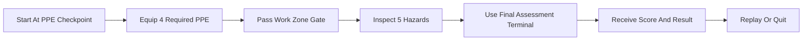

# Unity VR Oil Safety Trainer Demo

Desktop-first Unity safety trainer demo for oil production site inspections, designed as a one-scene MVP with a VR-ready architecture.

## Overview

This project simulates a short industrial safety walkthrough:

- select required PPE before entering the work zone,
- inspect five site hazards,
- complete a final assessment with scoring and replay support.

The current version targets keyboard and mouse interaction so the training loop can be validated quickly on a standard Windows machine. The scene structure and core gameplay scripts are organized to make a later OpenXR/XR rig swap straightforward.

## Highlights

- Unity `6000.4.11f1`
- Desktop fallback controls with a `PlayerRig` abstraction for future XR support
- Russian-language UI and assessment flow
- Data-driven scenario state for PPE, hazards, penalties, and scoring
- Edit Mode regression tests covering scene layout, gameplay flow, reset behavior, and HUD text fit
- Graybox industrial environment built entirely from Unity primitives and local materials

## Training Flow



## Controls

- `WASD` - movement
- `Mouse` - look
- `E` - interact
- `H` - show or hide the guide
- `R` - reset scenario
- `Q` - quit demo
- `Esc` - pause cursor lock

## Project Structure

```text
Assets/
  Editor/      scene and project generator
  Materials/   generated Unity materials
  Scenes/      demo scene
  Scripts/     gameplay, UI, player, and scenario logic
  Tests/       Edit Mode regression tests
  Textures/    local texture set used by the environment
Packages/
ProjectSettings/
```

## Core Scripts

- `SafetyScenarioManager` - orchestrates scenario flow, checklist updates, guide content, scoring, and final assessment
- `SafetyScenarioState` - tracks PPE state, hazards, penalties, and score calculation
- `DesktopPlayerController` - movement, look, interaction raycast, pause, reset, and quit input
- `PlayerRig` - player rig abstraction for current desktop mode and future XR mode
- `PpeStation` - PPE interactions and state visualization
- `HazardInspectionPoint` - hazard interactions and inspection state
- `WorkZoneGate` - PPE gate check
- `FinalAssessmentStation` - scenario completion trigger
- `ScorePanelController` - HUD, guide, prompts, transient messages, and final screen

## Verification

The project includes Edit Mode tests for:

- generated scene integrity,
- player spawn safety and clear camera start,
- PPE gate coverage,
- gameplay walkthrough and scoring,
- reset behavior,
- HUD layout bounds and representative Russian text fit.

## Running The Project

1. Open the project in Unity `6000.4.11f1`.
2. Open `Assets/Scenes/OilSafetyTrainerDemo.unity`.
3. Press Play in the editor.

To regenerate the demo scene:

- Unity menu: `Oil Safety Trainer/Rebuild Demo Scene`

## Portfolio Positioning

This repository is intentionally scoped as an MVP training simulator rather than a polished multi-module production course. The focus is on:

- scenario logic,
- interaction flow,
- training UX,
- UI readability,
- testable Unity architecture,
- clear extension path toward VR/OpenXR.

## Asset Notes

- Environment visuals use Unity primitives, locally generated materials, and bundled local textures.
- Integrated training visuals now include tracked poster, PPE, terminal, and hazard reference art under `Assets/Art/`, wired into the generated scene.
- Source texture credits are retained in `Assets/Textures/PolyHaven/CREDITS.md`.
- Local review drafts in `Assets/Review/` remain intentionally untracked so the repository only contains curated runtime assets.
